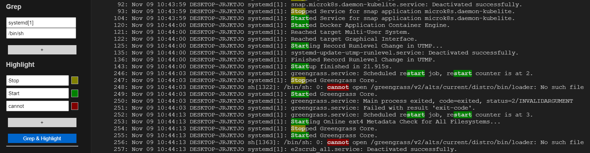

# Grep Sidebar README

## Features

Grep and Highlight Log.

### Grep

You can Grep by multi word.
Log is greped lines include any word.

### Highlight

You can Highlight by multi word.
Highlight color changes depending on whether VSCode Theme is Dark or not.

### Setting Save & Load

If you want save current setting, fill name and click "Save".
If you want load setting saved before, select setting name and click "Load".

## 

## Release Notes

Users appreciate release notes as you update your extension.

### 0.0.1

Create.

---
